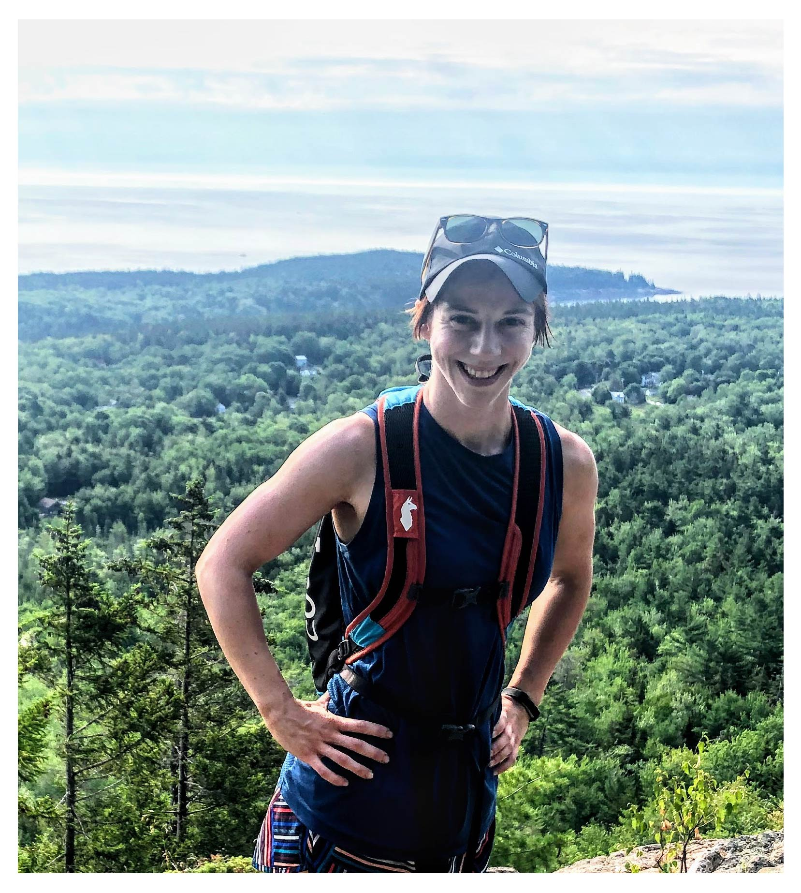

<link rel="shortcut icon" type="image/x-icon" href="favicon2.svg">

I am a Ph.D candidate studying Bioinformatics in the [Quantitative and Computational Biosciences & Bioengineering](https://umassmed.edu/es/gsbs/current-students/computational-biomedical-sciences-and-engineering/) Joint Graduate Program at University of Massachusetts Medical School and Worcester Polytechnic Institute. I am advised by [Anastasia Khvorova](https://www.umassmed.edu/khvorovalab/) and [Dmitry Korkin](http://korkinlab.org). 

My research bridges biology with computer science to advance therapeutic development and, more generally, expand our understanding of biological processes. My primary focus is on applying machine learning techniques to probe the small interfering RNA (siRNA) gene silencing mechanism. I am passionate about increasing access to advanced computational algorithms for life science researchers without computational training, through developing easy-to-use computational tools that do not require any computer programming knowledge. 

I conducted my undergraduate studies at the Colorado School of Mines and the University of Massachusetts Amherst where I completed my BS summa cum laude. I completed my MS in the Laboratory of [Alejandro Heuck](https://people.biochem.umass.edu/heuck/research.html) at the University of Massachusetts Amherst. 

# Research Experience
**UMass Medical School & Worcester Polytechnic Institute** - Ph.D. Candidate, Prof. Anastasia Khvorova and Prof. Dmitry Korkin Laboratories

**Advirna** - Asociate Scientist, Bioinformatics

**UMass Amherst** - M.S. Research Assistantship, Prof. Alejandro Heuck Laboratory

**Biogen** - Intern, Antibody Discovery

# Publications
Shmushkovich, T.,\* **Monopoli, K.R.,\*** Homsy, D., Leyfer, D., Betancur-Boissel, M., Khvorova, A., Wolfson, A. (2018) Functional features defining the efficacy of cholesterol-conjugated, self-deliverable, chemically modified siRNAs. Nucleic Acids Research. \***equally-contributing first authors** [[paper]](https://academic.oup.com/nar/article/46/20/10905/5085976)

Hariharan, V.N., Shin, M., Chang, C., O’Reilly, D., Biscans, A., Yamada, K., Guo, Z., Somasundaran, M., Tang, Q., **Monopoli, K.R.**, Krishnamurthy, P.M., Devi, G., McHugh, N., Cooper, D.A., Echeverria, D., Cruz, J., Chan, I.L., Liu, P., Lim, S., McConnell, J., Singh, S.P., Hildebrand, S., Sousa, J., Davis, S.M., Kennedy, Z., Ferguson, C., Godinho, B.M.D.C., Thillier, Y., Caiazzi, J., Ly, S., Muhuri, M., Kelly, K., Humphries, F., Cousineau, A., Parsi, K.M., Li, Q., Wang, Y., Maehr, R., Gao, G., Korkin, D., McDougall, W.M., Korkin, D., Fitzgerald, K.A., Finberg, R.W., Wang, J.P., Watts, J.K., Khvorova, A. (2022) Divalent siRNAs are bioavailable in the lung and efficiently block SARS-CoV-2 infection. In review, Nature Biotechnology.

Tang, Q., Sousa, J., Echeverria, D., Fan, X., Hsueah, Y.C., Afshari, K., MeHugh, N., Cooper, D.A., Vangjeli, L., **Monopoli, K.R.**, Okamura K, Biscans A, Clauss A, Harris JE, Khvorova A. (2022) RNAi-based modulation of IFN-γ signaling in skin. Molecular Therapy. [[paper]](https://www.cell.com/molecular-therapy-family/molecular-therapy/fulltext/S1525-0016(22)00249-0?_returnURL=https%3A%2F%2Flinkinghub.elsevier.com%2Fretrieve%2Fpii%2FS1525001622002490%3Fshowall%3Dtrue)

Romano, F.B., Rossi, K.C., Tang, Y., **Monopoli, K.R.**, Ross, J.L., Heuck, A.P. (2016) Type 3 Secretion translocators spontaneously assemble a hexadecameric transmembrane complex. Journal of Biological Chemistry. [[paper]](https://www.ncbi.nlm.nih.gov/pmc/articles/PMC5995524/)

# Talks
Monopoli, K.R., Korkin, D., Khvorova, A. Trichotomous classification on small, limited datasets enables predictive model development for therapeutic small interfering RNA. Talk presented at the Intelligent Systems for Molecular Biology (ISMB); 2022 Jul 10; Madison, WI.

Monopoli, K.R., Korkin, D., Khvorova, A. Evaluation-centric method for extracting base preferences from siRNA prediction models identifies features consistent with established mechanisms and is adaptable to examine any machine learning model. Talk presented at the RNA Therapeutics Symposium; 2022 Jun 22; Worcester, MA. [[recorded talk]](https://youtu.be/f_4O-Cq9PG0)

Monopoli, K.R., Korkin, D., Khvorova, A.  Methods to apply and evaluate machine learning models on limited biological datasets through the lens of siRNA design. Invited talk presented at Oligonucleotide Therapeutics Society Seminar.

## Conference Posters
Monopoli, K.R., Korkin, D., Khvorova, A. Trichotomous classification on small, limited datasets enables predictive model development for therapeutic small interfering RNA. Poster presented at the Intelligent Systems for Molecular Biology (ISMB); 2022 Jul 10; Madison, WI.

Monopoli, K.R., Korkin, D., Khvorova, A. Data Partitioning to Enable Application of Machine Learning Models to Limited Biological Datasets Using SiRNA Design as an Example Case. Poster at the Oligonucleotide Therapeutics Society Meeting; Sep 2021; virtual. [[recorded poster presentation]](https://youtu.be/xtk9x210RmE)

Monopoli, K.R., siRNA Screening Consortium, Korkin, D., Khvorova, A. Predicting siRNA Silencing Efficacy using Supervised Machine Learning. Poster presentation at the RNA Therapeutics Symposium; 2021 June 28; Worcester, MA. [[poster]](https://vepimg.b8cdn.com/uploads/vjfnew/4489/content/images/1622548685rti-poster-kathryn-monopoli-pdf1622548685.pdf)[[video overview]](https://vimeo.com/557558254)

Monopoli, K.R., Heuck, A.P. PopB and PopD interact simultaneously when forming the putative translocon in the Pseudomonas aeruginosa Type III Secretion System. Poster presentation at the Molecular and Cellular Biology Program Annual Retreat; 2015 Feb 28; Amherst, MA. 

Monopoli, K.R., Heuck, A.P. Forming the Pseudomonas aeruginosa translocon requires simultaneous incorporation of PopB and PopD. Poster presentation at the Biophysical Society Annual Meeting; 2015 Feb 6-11; Baltimore, MD. [[abstract]](https://www.cell.com/biophysj/comments/S0006-3495(14)01752-4)

Monopoli, K.R., Romano, F.B., Heuck, A.P. Characterization of membrane-assembled Pseudomonas aeruginosa Type III Secretion System Translocon. Poster presented at the Models to Medicine Conference; 2014 May 2; Amherst, MA.

Monopoli, K.R., Romano, F.B., Heuck, A.P. Structural Studies of the Membrane Bound Translocon of the Pseudomonas aeruginosa Type III Secretion System. Poster presented at the Undergraduate Symposium for the American Chemical Society; 2014 April 26; Amherst, MA.

Monopoli, K.R., Romano, F.B., Heuck, A.P. Characterization of the Pseudomonas aeruginosa Type III Secretion Translocon in Model Membranes. Poster presented at the Massachusetts Undergraduate Statewide Research Conference; 2014 April 25; Amherst, MA.

Monopoli, K.R., Romano, F.B., Heuck, A.P. PopB modulates the interaction of PopD with membranes. Poster presented at the UMass Homecoming Poster Session; 2013 Oct 18; Amherst, MA.

Monopoli, K.R., Pearse, B.R. Generation of a repertoire of antibodies for clinical assay development by phage display. Poster presented at Biogen Intern Poster Session; 2013 Aug 22; Cambridge, MA.  

## Theses
Monopoli, K.R. Advised by Prof. Alejandro Heuck. “Characterization of the Reconstituted and Native Pseudomonas aeruginosa Type III Secretion System Translocon”. Master's Thesis. University of Massachusetts, Amherst, September 2015. 

Monopoli, K.R. Advised by Prof. Alejandro Heuck. “Characterization of the Pseudomonas aeruginosa Type III Secretion System Translocon in Model Membranes”. Undergraduate Thesis. University of Massachusetts, Amherst, May 2014. 

*[Other Projects](https://github.com/kmonopoli)*

## Patents
Oligonucleotides for MAPT Modulation - US Utility Patent Application No. 62/991,405, 3/18/2020

Oligonucleotides for SNCA Modulation - US Utility Patent Application No. 62/991,406, 3/18/2020

Oligonucleotides for MSH3 Modulation - US Patent Application No. 63/012,603, 4/20/2020

Oligonucleotides for MAPT Modulation - US Utility Patent Application No. 63/071,106, 8/27/2020

Oligonucleotides for SNCA Modulation - US Utility Patent Application No. 63/071,115, 8/27/2020

Oligonucleotides for SARS-CoV-2 Modulation - US Utility Patent Application No. 63/031,222, 5/28/2020

Oligonucleotides for SARS-CoV-2 Modulation - US Utility Patent Application No. 63/084,817, 9/29/2020

Oligonucleotides for MAPT Modulation - US Patent Application No. 17/204,480, 3/17/2021

Oligonucleotides for MAPT Modulation - Intl Patent Application No. PCT/US2021/022688, 3/17/2021

Oligonucleotides for SNCA Modulation - US Patent Application No. 17/204,483, 3/17/2021

Oligonucleotides for SNCA Modulation - Intl Patent Application No. PCT/US2021/022748, 3/17/2021

Oligonucleotides for SARS-CoV-2 Modulation - US Patent Application No. 17/333,839, 5/28/2021

Oligonucleotides for SARS-CoV-2 Modulation - Intl Patent App No. PCT/US2021/035002, 5/28/2021

## Teaching Experience
CS 1101: **Introduction to Programming Design** (WPI) - Teaching Assistant (Fall 2019)

CS 2102: **Advanced Object-Oriented Design Concepts** (WPI) - Teaching Assistant (Fall 2019)

BIOCHEM 471: **Physical Chemistry** (UMass Amherst) - Teaching Assistant(Spring 2014)

BIOLOGY 311: **General Genetics** (UMass Amherst) - Teaching Assistant (Fall 2013)

## Fellowships and Awards
Poster Award – Oligonucleotide Therapeutics Society 2021 Annual Meeting

Fuller Scholarship

Phi Beta Kappa

Kappa Mu Epsilon - Honors Society for Mathematics

Henry Little Award for Excellence in Research and Academics

GO-MAP Graduate Top Scholars Award

Biophyscal Society Travel Award

Honors Research Grant - University of Massachusetts Amherst

Research Assistant Fellowship - University of Massachusetts Amherst

Phi Kappa Phi

Presidential Scholarship - Colorado School of Mines

## Service
[TouchTomorrow WPI](https://wp.wpi.edu/touchtomorrow/) - volunteer

[UMass STEM Ambassadors](https://www.umass.edu/stemambassadors/mentoring-opportunities) - mentor

[Biogen Community Lab](https://www.biogen.com/en_us/community-lab-summer.html) - instructor

[Engineering Projects in Community Service](https://minesmagazine.com/2482/) - project manager, designer

[Bright Spot Therapy Dogs](https://www.umass.edu/stemambassadors/mentoring-opportunities) - handler

[Hector Reyes House](https://www.lahaworc.org) - volunteer

