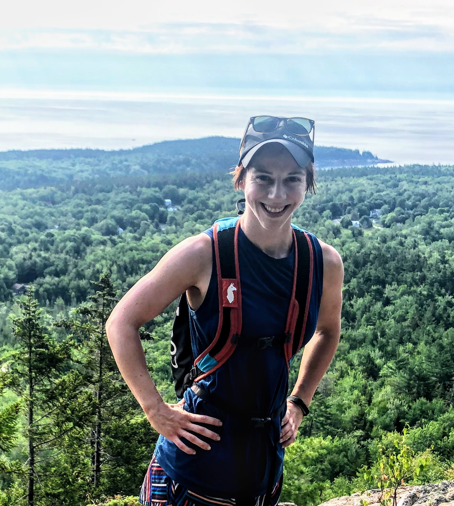

I am a Ph.D candidate studying Bioinformatics in the [Quantitative and Computational Biosciences & Bioengineering](https://umassmed.edu/es/gsbs/current-students/computational-biomedical-sciences-and-engineering/) Joint Graduate Program at UMass Medical School and Worcester Polytechnic Institute. I am advised by [Anastasia Khvorova](https://www.umassmed.edu/khvorovalab/) and [Dmitry Korkin](http://korkinlab.org). I am interested in developing methods to bridge biology, computer science, and data science. My broad research goals are to expand the application of advance computational methods in the biological realm to build our general understanding of biology and to develop therapeutics. My primary focus is on applying machine learning techniques to enhance our understanding of the small interfering RNA gene silencing mechanism. I am passionate about increasing access of computational tools to biologists through developing easy-to-use computational tools that do not require any coding knowledge. I conducted my undergraduate studies at the Colorado School of Mines and the University of Massachusetts Amherst where I completed my BS summa cum laude. I completed my MS in the Laboratory of [Alejandro Heuck](https://people.biochem.umass.edu/heuck/research.html) at the University of Massachusetts Amherst. I transitioned from bench work where I conducted biophysical assays to assess membrane protein structure to computational research studying small interfering RNAs.

## Publications
**Shmushkovich, T.,\* Monopoli, K.R.,\*** Homsy, D., Leyfer, D., Khvorova, A., Wolfson, A. (2018) Algorithm for predicting efficacy of chemically modified siRNAs. Submitted to Nucleic Acids Research. \***equally-contributing first authors** [[paper]](https://academic.oup.com/nar/article/46/20/10905/5085976)

Romano, F.B., Rossi, K.C., Tang, Y., **Monopoli, K.R.**, Ross, J.L., Heuck, A.P. (2016) Type 3 Secretion translocators spontaneously assemble a hexadecameric transmembrane complex. Journal of Biological Chemistry. [[paper]](https://www.ncbi.nlm.nih.gov/pmc/articles/PMC5995524/)

## Conferences
Monopoli, K.R., siRNA Screening Consortium, Korkin, D., Khvorova, A. Predicting siRNA Silencing Efficacy using Supervised Machine Learning. Poster presentation at the RNA Therapeutics Symposium; 2021 June 28; Worcester, MA. [[poster]](https://vepimg.b8cdn.com/uploads/vjfnew/4489/content/images/1622548685rti-poster-kathryn-monopoli-pdf1622548685.pdf)

Monopoli, K.R., Heuck, A.P. PopB and PopD interact simultaneously when forming the putative translocon in the Pseudomonas aeruginosa Type III Secretion System. Poster presentation at the Molecular and Cellular Biology Program Annual Retreat; 2015 Feb 28; Amherst, MA. 

Monopoli, K.R., Heuck, A.P. Forming the Pseudomonas aeruginosa translocon requires simultaneous incorporation of PopB and PopD. Poster presentation at the Biophysical Society Annual Meeting; 2015 Feb 6-11; Baltimore, MD. [[abstract]](https://www.cell.com/biophysj/comments/S0006-3495(14)01752-4)

Monopoli, K.R., Romano, F.B., Heuck, A.P. Characterization of membrane-assembled Pseudomonas aeruginosa Type III Secretion System Translocon. Poster presented at the Models to Medicine Conference; 2014 May 2; Amherst, MA.

Monopoli, K.R., Romano, F.B., Heuck, A.P. Structural Studies of the Membrane Bound Translocon of the Pseudomonas aeruginosa Type III Secretion System. Poster presented at the Undergraduate Symposium for the American Chemical Society; 2014 April 26; Amherst, MA.

Monopoli, K.R., Romano, F.B., Heuck, A.P. Characterization of the Pseudomonas aeruginosa Type III Secretion Translocon in Model Membranes. Poster presented at the Massachusetts Undergraduate Statewide Research Conference; 2014 April 25; Amherst, MA.

Monopoli, K.R., Romano, F.B., Heuck, A.P. PopB modulates the interaction of PopD with membranes. Poster presented at the UMass Homecoming Poster Session; 2013 Oct 18; Amherst, MA.

Monopoli, K.R., Pearse, B.R. Generation of a repertoire of antibodies for clinical assay development by phage display. Poster presented at Biogen Intern Poster Session; 2013 Aug 22; Cambridge, MA.  

## Fellowships and Awards
Fuller Scholarship

Phi Beta Kappa

Kappa Mu Epsilon - Honors Society for Mathematics

Henry Little Award for Excellence in Research and Academics

GO-MAP Graduate Top Scholars Award

Biophyscal Society Travel Award

Honors Research Grant (UMass Amherst)

Research Assistant Fellowship (UMass Amherst)

Phi Kappa Phi

Presidential Scholarship - Colorado School of Mines

## Teaching
CS 1101: **Introduction to Programming Design** (WPI) - Teaching Assistant (Fall 2019)

CS 2102: **Advanced Object-Oriented Design Concepts** (WPI) - Teaching Assistant (Fall 2019)

BIOCHEM 471: **Physical Chemistry** (UMass Amherst) - Teaching Assistant(Spring 2014)

BIOLOGY 311: **General Genetics** (UMass Amherst) - Teaching Assistant (Fall 2013)

## Research Experience
**UMass Medical School & Worcester Polytechnic Institute** Ph.D. Candidate - Anastasia Khvorova and Dmitry Korkin Laboratories

**Advirna** Asociate Scientist, Bioinformatics

**UMass Amherst** M.S. Research Assistantship - Alejandro Heuck Laboratory

**Biogen** Intern, Antibody Discovery

## Service
Bright Spot Therapy Dogs - dog handler

Hector Reyes House Worcester - volunteer

UMass STEM mentor

Engineering Projects in Community Service - project manager

